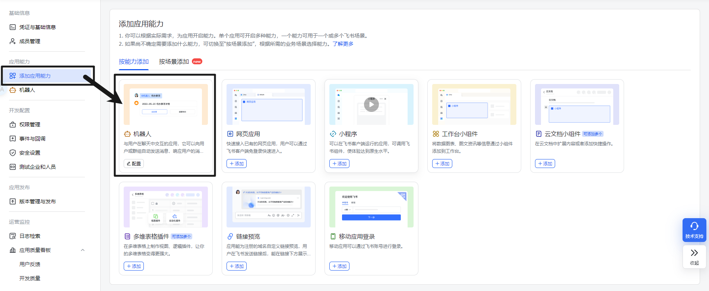
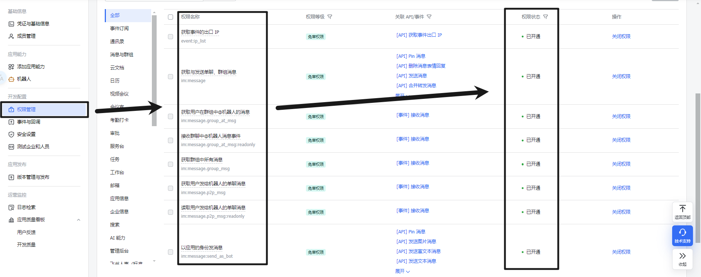
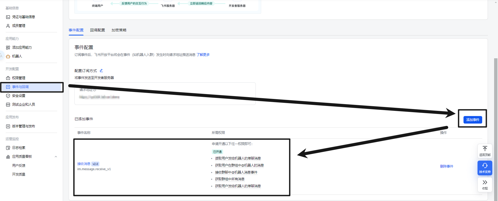
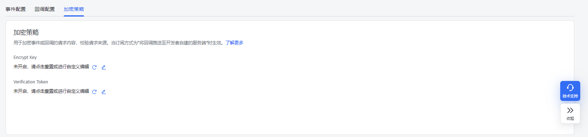
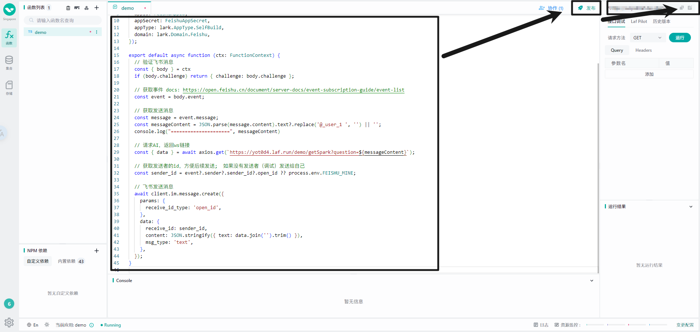
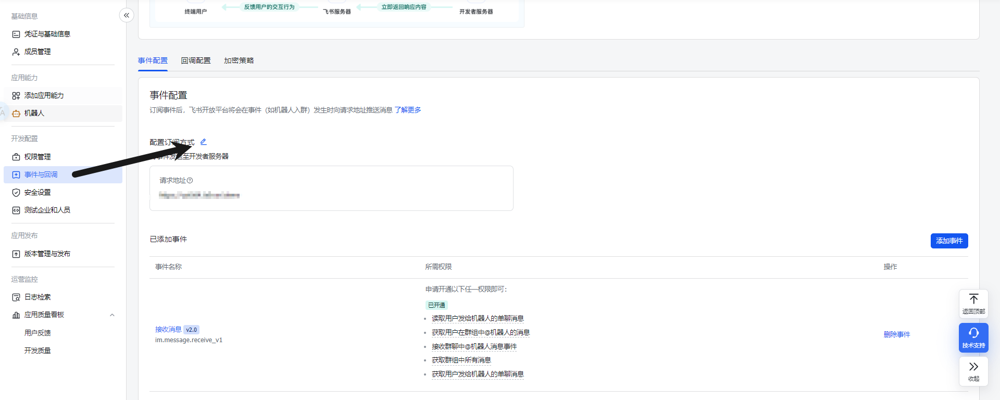

# 🐦 Lark-Laf-Spark-Bot


飞书机器人通过 Laf 接入星火大模型的机器人

开源的意义：如果没有接触过飞书机器人，会遇到非常多的问题让人十分苦恼，所以为了节约大家时间，开源这套代码并列出流程方面后续开发

## ✨ 特性

- 📦 开箱即用，复制粘贴就可以使用
- 🚀 快速搭建，基于云开发
- 🔜 快速上手，只有两个文件

## 🌅 效果图


## 👨‍🌾 搭建过程

### 🤖 1.1 创建一个飞书机器人
1. 登录网站：https://open.feishu.cn/app?lang=zh-CN
2. 点击`创建企业自建应用`
3. 创建完成后，访问【凭证与基础信息】页面，复制 APPID 和 Secret 备用。


### 🤖 1.2 添加机器人能力



### 开启权限 & 事件
1. 开启权限
- `event:ip_list`
- `im:message` 
- `im:message.group_at_msg` 
- `im:message.group_at_msg:readonly` 
- `im:message.p2p_msg` 
- `im:message.p2p_msg:readonly` 
- `im:message:send_as_bot`
- `im:message.group_at_msg`



2. 开启事件（`接收消息 v2.0`）



### 🤖 1.3 关闭加密



### ☁️ 1.4 Laf: 填写环境变量 & 安装依赖
依赖
```text
@larksuiteoapi/node-sdk 1.27.0
axios 1.6.8
ws 8.13.0
```

环境变量，这里要去申请星火大模型的API：

- [讯飞开放平台](https://console.xfyun.cn/services)

```text
FS_APPID 飞书机器人相关

FS_APPSECRET 飞书机器人相关

XH_APPID 星火大模型相关

XH_APISecret 星火大模型相关

XH_APIKey 星火大模型相关

FEISHU_MINE 飞书的OpenId 用于兜底
```

### 🔗 1.5 复制代码 & 发布 & 连接飞书机器人
1. 复制代码到laf
2. 复制laf链接



3. 填写到`事件与回调` -> 请求地址



### 🤖 1.6 发布机器人 & 启动！
上述这些都配置完成后，你的机器人就配置好了，接下来只需要在飞书开放平台后台找到应用发布，创建一个全新的版本并发布版本即可。

## 📄 参考文档
1. laf: https://laf.dev/
2. laf文档：https://doc.laf.run/zh/
3. 飞书开放平台：https://open.feishu.cn/app?lang=zh-CN
4. 飞书事件列表：https://open.feishu.cn/document/server-docs/event-subscription-guide/event-list
5. 飞书开放文档：https://open.feishu.cn/document/home/index
6. 飞书API列表：https://open.feishu.cn/document/server-docs/api-call-guide/server-api-list

## 🌼 感谢以下开源贡献
- [ChatGPT-Feishu](https://github.com/bestony/ChatGPT-Feishu)
- [feishu-openai](https://github.com/ConnectAI-E/feishu-openai)